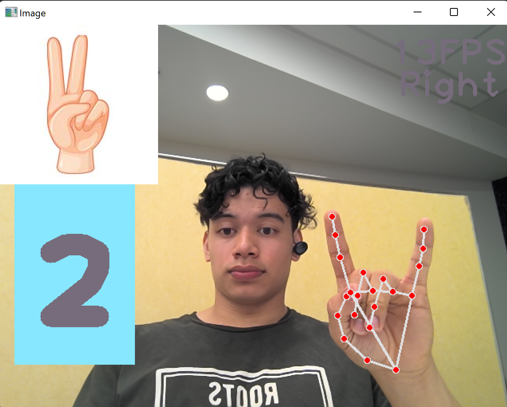

# Finger-Counter

Hey! This script uses OpenCV and MediaPipe to count the number of fingers you hold up

<!--  -->




Make sure to install the required libraries before you begin.
For Computer Vision:
```python
pip install opencv-python
```
For Hand Detection:
```python
pip install mediapipe
```
